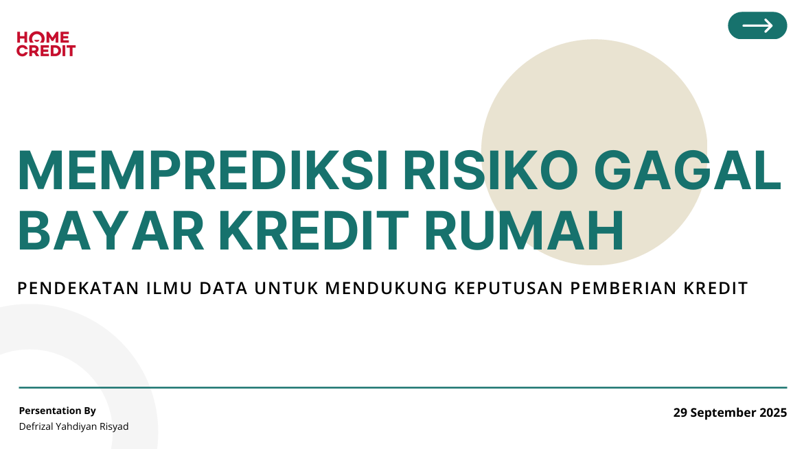

# **Predicting the Risk of Default on Home Credit**



A Data Science Approach to Supporting Credit Granting Decisions

## 📋 Project Overview


This project aims to predict loan default risk using the Home Credit Default Risk dataset, which contains comprehensive customer information, credit history, and payment records. The analysis involves in-depth data exploration, cleaning, and feature engineering from multiple data sources to build machine learning and deep learning models that can assist financial institutions in assessing creditworthiness more accurately.

## 🎯 Business Problem

How can we accurately predict the probability of loan default using applicant information and historical credit data?

## 🎯 Business Objectives

1. Identify potential borrowers at risk of default early.

2. Improve prediction accuracy to minimize risk.

3. Provide practical recommendations to support business decision-making.

## 📊 Dataset Description

The project utilizes multiple datasets from Home Credit:

- **application_train.csv**: Primary training data with loan application information
- **application_test.csv**: Test data for competition submissions
- **bureau.csv**: Client's previous credits from other financial institutions
- **bureau_balance.csv**: Monthly balances of previous credits
- **previous_application.csv**: Previous loan applications at Home Credit
- **POS_CASH_balance.csv**: Point of sales and cash loan monthly balances
- **credit_card_balance.csv**: Monthly credit card balances
- **installments_payments.csv**: Payment history for previous loans

## 🛠️ Technical Implementation

### 1. Data Preprocessing & Feature Engineering

- **Missing Value Handling**: 
  - Numeric columns: Imputed with median values
  - Categorical columns: Filled with 'MISSING' category
  
- **Feature Engineering**:
  - Age calculation from days since birth
  - Years employed conversion
  - Income per family member
  - Credit-to-income ratio
  - Annuity-to-income ratio

### 2. Aggregated Features

Created comprehensive features from bureau data including:
- Credit duration statistics (min, max, mean days)
- Overdue credit patterns
- Credit sum aggregates
- Debt amount summaries

### 3. Exploratory Data Analysis

Key insights uncovered:
- Default rates by income type
- Age group impact on default probability
- Correlation analysis of EXT_SOURCE features with target variable

## 🤖 Models Implemented

### Traditional Machine Learning
1. **Random Forest Classifier**
   - 100 estimators with balanced class weights
   - Comprehensive feature importance analysis
   - Cross-validation evaluation

2. **LightGBM Classifier**
   - Gradient boosting with early stopping
   - Advanced hyperparameter tuning
   - Feature importance ranking

### Deep Learning
1. **Simple Feedforward Neural Network**
   - Architecture: 128 → 64 → 32 neurons
   - Dropout regularization (30%, 20%)
   - ReLU activation with sigmoid output

2. **Deep Neural Network with Batch Normalization**
   - Architecture: 256 → 128 → 64 → 32 neurons
   - Batch normalization layers
   - Higher dropout rates for regularization
   - Advanced optimization with callbacks

## 📈 Model Performance

### Evaluation Metrics

* **AUC-ROC** (Primary metric)
* **Accuracy**
* **Precision**
* **Recall**
* **F1-Score**

### Performance Comparison

All models are comprehensively evaluated and compared using:

* ROC curve analysis
* Confusion matrices
* Training history visualization
* Feature importance analysis

### 🔢 Detailed Results

| Model         | AUC    | Accuracy | Precision | Recall | F1-Score |
| ------------- | ------ | -------- | --------- | ------ | -------- |
| Random Forest | 0.7359 | 0.7276   | 0.1687    | 0.6048 | 0.2639   |
| LightGBM      | 0.7628 | 0.7554   | 0.1893    | 0.6183 | 0.2898   |
| Simple NN     | 0.7479 | 0.6951   | 0.1636    | 0.6753 | 0.2634   |
| Deep NN       | 0.7507 | 0.7235   | 0.1727    | 0.6397 | 0.2720   |

### 📊 Model Ranking (by AUC)

1. **LightGBM** – AUC = 0.7628, Accuracy = 0.7554, F1 = 0.2898
2. Deep Neural Network – AUC = 0.7507, Accuracy = 0.7235, F1 = 0.2720
3. Simple Neural Network – AUC = 0.7479, Accuracy = 0.6951, F1 = 0.2634
4. Random Forest – AUC = 0.7359, Accuracy = 0.7276, F1 = 0.2639

### 🏆 Best Performing Model: LightGBM

* **AUC**: 0.7628
* **Accuracy**: 0.7554
* **F1-Score**: 0.2898
* **Advantage**: Outperformed Deep NN (2nd place) by **0.0121 AUC**

### 📌 Overall Performance Range

* **AUC**: 0.7359 – 0.7628
* **Accuracy**: 0.6951 – 0.7554
* **F1-Score**: 0.2634 – 0.2898

✅ LightGBM consistently outperformed other models, proving to be the most reliable for this credit default prediction task.


## 🚀 Key Features

### Technical Excellence
- **Comprehensive Data Integration**: Multiple data sources merged and engineered
- **Advanced Feature Engineering**: Domain-specific feature creation
- **Model Diversity**: Traditional ML and deep learning approaches
- **Robust Evaluation**: Multiple metrics and visualization techniques

### Business Relevance
- **Interpretable Results**: Feature importance and business insights
- **Practical Implementation**: Ready-to-use prediction pipeline
- **Risk Assessment**: Probability-based default predictions

## 📁 Project Structure
home-credit-default-risk/

├── data/

│ ├── application_train.csv

│ ├── application_test.csv

│ └── ... (other dataset files)

├── pitch deck/

│ ├── pitch_deck.pdf

├── submissions/

│ ├── home_credit_submission.csv

│ └── home_credit_ensemble_submission.csv

└── notebook.ipynb

└── README.md


## 🔧 Requirements

```bash
pip install pandas numpy matplotlib seaborn scikit-learn lightgbm tensorflow torch
```

## 🏆 Results

The project delivers:

1. Multiple trained models with performance comparisons
2. Feature importance analysis for business interpretation
3. Test predictions ready for competition submission
4. Comprehensive documentation of methodology and insights

## 📊 Key Insights & Business Recommendations
### 🔑 Key Findings
- **Default Rate:** Overall dataset default rate = 8.07%
- **High-Risk Segments:**
   - **Income type "Maternity leave":** 40% default rate
   - **Age group 0–25 years:** 12.29% default rate
- **Most Important Features:** EXT_SOURCE_3 (-0.156), EXT_SOURCE_2 (-0.160), EXT_SOURCE_1 (-0.099)
- **Best Model:** LightGBM achieved AUC = 0.7628, outperforming Deep NN (0.7507)

## 💼 Business Recommendations
1. **Enhance External Data Usage:** Improve quality and frequency of EXT_SOURCE updates for better credit scoring.
2. **Segment-Based Credit Policy:** Apply stricter rules or adjusted products (e.g., higher interest, lower limits) for high-risk groups.
3. **Automated Decision System:** Deploy LightGBM as the primary risk scoring engine, while fine-tuning thresholds to balance Precision vs. Recall.

## ⚙️ Solution Highlights
- **Model:** LightGBM classifier with engineered features & ensemble option
- **Pipeline:** Integrated credit history, application data, and payment records
- **Deployment:** Produces default probability for new applications, ready for business integration

## 📌 Conclusion & Next Steps
- **LightGBM** proved to be the best-performing model for this problem (AUC 0.7628).
- **EXT_SOURCE features** remain the most critical predictors.
- **Next steps:** Tune LightGBM further and explore ensemble methods to maximize AUC and balance Precision–Recall tradeoffs.


## 👥 Contributors

Defrizal Yahdiyan Risyad 

